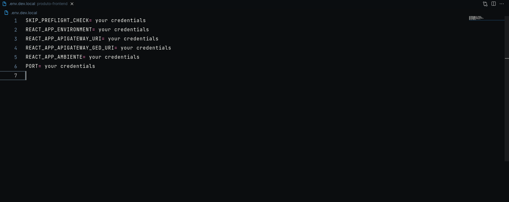

# Ultron CLI

## Simple cli for manager Ultron Project

### install

- ```console
  npm i ultron-cli
  ```

- configure your projects paths env

```console
    export PROJECT_PRODUTO_PATH=~/projects/brmf/produto-frontend
    export PROJECT_ASSISTENCIA_PATH=~/projects/brmf/assistencia-frontend
    export PROJECT_ULTRON_MAIN_PATH=~/projects/brmf/ultron-login-frontend
```

- Create your environment variables in your project



- **importante !**
  your env files need to following nomenclature `.env.{env type}}.local`

  ex: `.env.dev.local`
